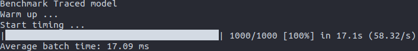
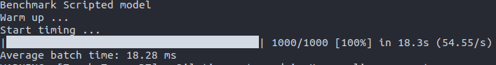
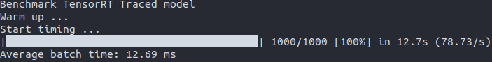
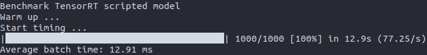

## Prerequisite
Let us start with the system information that is being used for this experiment.
The best way to start and test the Torch-TensorRT setup is to use an Nvidia-NGC docker container. To lower the initial setup time(I wasted a lot of time trying to match the dependencies).

OS: Ubuntu 20.04 LTS    
GPU: NVIDIA Corporation GP107M [GeForce GTX 1050 Mobile] / NVIDIA GeForce GTX 1050/PCIe/SSE2    
Container: [nvcr.io/nvidia/pytorch:22.05-py3](https://catalog.ngc.nvidia.com/orgs/nvidia/containers/pytorch/tags#:~:text=Search%20tags...-,22.05%2Dpy3,-06/02/2022)   
NVIDIA-SMI 510.73.05    
Driver Version: 510.73.05    
CUDA Version: 11.6  
We will be using alive_progress library for the progress bar.
```pip install alive_progress```


## Model 
Today we will be using the ResNet34 dummy model with initial weights to do an FP32 format inference.

## Experiments

* ### Launching docker 
First let us pull the nvidia-pytorch docker.

```bash
docker pull nvcr.io/nvidia/pytorch:22.05-py3
```

Run the docker in the detached mode with all the gpu's present on the host device. 

I like running the docker like this as a 2 stage process so that i can exit docker and then commit a new docker with the changes i have done inside the docker.

```bash
docker run --gpus=all -it -d --net=host --ipc=host --ulimit memlock=-1 --ulimit stack=67108864 nvcr.io/nvidia/pytorch:22.05-py3
docker exec -it <docker_hash> bash
```

* ### Benchmark Function
This function takes the model, input shape nwarmup and nruns args and first warm's up the gpu and then does the specified iterations to compute the required benchmark timing.




```python
def benchmark(
    model,
    input_shape=(1024, 1, 32, 32),
    dtype="fp32",
    nwarmup=50,
    nruns=1000,
):
    cudnn.benchmark = True
    input_data = torch.randn(input_shape)
    input_data = input_data.to("cuda")
    if dtype == "fp16":
        input_data = input_data.half()

    print("Warm up ...")
    with torch.no_grad():
        for _ in range(nwarmup):
            features = model(input_data)
    torch.cuda.synchronize()
    print("Start timing ...")
    timings = []
    with torch.no_grad(), alive_bar(nruns) as bar:
        for i in range(1, nruns + 1):
            start_time = time.time()
            features = model(input_data)
            torch.cuda.synchronize()
            end_time = time.time()
            timings.append(end_time - start_time)
            bar()

    print("Average batch time: %.2f ms" % (np.mean(timings) * 1000))
```



* ### Basic Pytorch Model
You can either use torchvision's out of the box provided model to do the benchmarking or use Mine version of ResNet34
I have provided ResNet implementation with the Args dict for ResNet34 you can modify the args dict accordingly to support multiple varients of ResNet.



```python
class BasicBlock(nn.Module):
    def __init__(self, conv1, conv2, activation=nn.ReLU(), downsample=False):
        super().__init__()
        self.Conv_1 = nn.Conv2d(**conv1)
        self.BN_1 = nn.BatchNorm2d(num_features=conv1["out_channels"])
        self.Conv_2 = nn.Conv2d(**conv2)
        self.BN_2 = nn.BatchNorm2d(num_features=conv1["out_channels"])
        self.downsample_flag = downsample
        self.downsample = nn.Identity()

        if downsample:
            self.downsample = nn.Conv2d(**conv1)
        self.activation = activation

    def forward(self, input_):
        input_copy = input_
        input_ = self.BN_1(self.activation(self.Conv_1(input_)))
        input_ = self.BN_2(self.activation(self.Conv_2(input_)))
        if self.downsample_flag:
            input_copy = self.activation(self.downsample(input_copy))
        return self.activation(input_ + input_copy)


class ResBlock(nn.Module):
    def __init__(self, blocks):
        super().__init__()
        layers = []
        for block, config in blocks.items():
            self.__dict__[block] = BasicBlock(**config)
            layers.append(self.__dict__[block])

        self.layers = nn.Sequential(*layers)

    def forward(self, input_):
        for layer in self.layers:
            input_ = layer(input_)

        return input_


class ResNet34(nn.Module):
    def __init__(
        self,
        conv_1,
        maxpool_1,
        conv2_x,
        conv3_x,
        conv4_x,
        conv5_x,
        avgpool,
        final_layer,
        activation=nn.ReLU(),
    ):
        super(ResNet34, self).__init__()
        self.activation = activation
        self.Conv_1 = nn.Conv2d(**conv_1)
        self.BN_1 = nn.BatchNorm2d(conv_1["out_channels"])
        self.MaxPool_1 = nn.MaxPool2d(**maxpool_1)
        self.Conv2_x = ResBlock(**conv2_x)
        self.Conv3_x = ResBlock(**conv3_x)
        self.Conv4_x = ResBlock(**conv4_x)
        self.Conv5_x = ResBlock(**conv5_x)
        self.AvgPool = nn.AvgPool2d(**avgpool)
        self.Final_layer = nn.Linear(**final_layer)

    def forward(self, input_):
        input_ = self.BN_1(self.activation(self.Conv_1(input_)))
        input_ = self.MaxPool_1(input_)
        input_ = self.Conv2_x(input_)
        input_ = self.Conv3_x(input_)
        input_ = self.Conv4_x(input_)
        input_ = self.Conv5_x(input_)
        input_ = self.AvgPool(input_)
        input_ = torch.flatten(input_, start_dim=1)
        output = self.Final_layer(input_)

        return output

    @classmethod
    def onnx_export(cls, **onnx_param):
        model = cls(**resnet34_args).eval()
        with torch.no_grad():
            input_ = torch.randn((1, 3, 224, 224))
            torch.onnx.export(
                model, input_, "resnet34.onnx", verbose=False, **onnx_param
            )
```




```python
resnet34_args = dict(
    conv_1=dict(
        in_channels=3, out_channels=64, stride=2, kernel_size=7, padding=3
    ),
    maxpool_1=dict(kernel_size=3, stride=2, padding=1),
    conv2_x=dict(
        blocks=dict(
            Block1=dict(
                conv1=dict(
                    in_channels=64, out_channels=64, kernel_size=3, padding=1
                ),
                conv2=dict(
                    in_channels=64, out_channels=64, kernel_size=3, padding=1
                ),
            ),
            Block2=dict(
                conv1=dict(
                    in_channels=64, out_channels=64, kernel_size=3, padding=1
                ),
                conv2=dict(
                    in_channels=64, out_channels=64, kernel_size=3, padding=1
                ),
            ),
            Block3=dict(
                conv1=dict(
                    in_channels=64, out_channels=64, kernel_size=3, padding=1
                ),
                conv2=dict(
                    in_channels=64, out_channels=64, kernel_size=3, padding=1
                ),
            ),
        )
    ),
    conv3_x=dict(
        blocks=dict(
            Block1=dict(
                conv1=dict(
                    in_channels=64,
                    out_channels=128,
                    kernel_size=3,
                    stride=2,
                    padding=1,
                ),
                conv2=dict(
                    in_channels=128, out_channels=128, kernel_size=3, padding=1
                ),
                downsample=True,
            ),
            Block2=dict(
                conv1=dict(
                    in_channels=128, out_channels=128, kernel_size=3, padding=1
                ),
                conv2=dict(
                    in_channels=128, out_channels=128, kernel_size=3, padding=1
                ),
            ),
            Block3=dict(
                conv1=dict(
                    in_channels=128, out_channels=128, kernel_size=3, padding=1
                ),
                conv2=dict(
                    in_channels=128, out_channels=128, kernel_size=3, padding=1
                ),
            ),
            Block4=dict(
                conv1=dict(
                    in_channels=128, out_channels=128, kernel_size=3, padding=1
                ),
                conv2=dict(
                    in_channels=128, out_channels=128, kernel_size=3, padding=1
                ),
            ),
        )
    ),
    conv4_x=dict(
        blocks=dict(
            Block1=dict(
                conv1=dict(
                    in_channels=128,
                    out_channels=256,
                    kernel_size=3,
                    stride=2,
                    padding=1,
                ),
                conv2=dict(
                    in_channels=256, out_channels=256, kernel_size=3, padding=1
                ),
                downsample=True,
            ),
            Block2=dict(
                conv1=dict(
                    in_channels=256, out_channels=256, kernel_size=3, padding=1
                ),
                conv2=dict(
                    in_channels=256, out_channels=256, kernel_size=3, padding=1
                ),
            ),
            Block3=dict(
                conv1=dict(
                    in_channels=256, out_channels=256, kernel_size=3, padding=1
                ),
                conv2=dict(
                    in_channels=256, out_channels=256, kernel_size=3, padding=1
                ),
            ),
            Block4=dict(
                conv1=dict(
                    in_channels=256, out_channels=256, kernel_size=3, padding=1
                ),
                conv2=dict(
                    in_channels=256, out_channels=256, kernel_size=3, padding=1
                ),
            ),
            Block5=dict(
                conv1=dict(
                    in_channels=256, out_channels=256, kernel_size=3, padding=1
                ),
                conv2=dict(
                    in_channels=256, out_channels=256, kernel_size=3, padding=1
                ),
            ),
            Block6=dict(
                conv1=dict(
                    in_channels=256, out_channels=256, kernel_size=3, padding=1
                ),
                conv2=dict(
                    in_channels=256, out_channels=256, kernel_size=3, padding=1
                ),
            ),
        )
    ),
    conv5_x=dict(
        blocks=dict(
            Block1=dict(
                conv1=dict(
                    in_channels=256,
                    out_channels=512,
                    kernel_size=3,
                    stride=2,
                    padding=1,
                ),
                conv2=dict(
                    in_channels=512, out_channels=512, kernel_size=3, padding=1
                ),
                downsample=True,
            ),
            Block2=dict(
                conv1=dict(
                    in_channels=512, out_channels=512, kernel_size=3, padding=1
                ),
                conv2=dict(
                    in_channels=512, out_channels=512, kernel_size=3, padding=1
                ),
            ),
            Block3=dict(
                conv1=dict(
                    in_channels=512, out_channels=512, kernel_size=3, padding=1
                ),
                conv2=dict(
                    in_channels=512, out_channels=512, kernel_size=3, padding=1
                ),
            ),
        )
    ),
    avgpool=dict(kernel_size=2),
    final_layer=dict(in_features=4608, out_features=1000),
)

```


Now let's benchmark the model

```python
    MAX_ITER = 1000
    BATCH_SIZE = 2  
    img_size = 224
    
    model = ResNet34(**resnet34_args)
    model.to("cuda").eval()
    input_shape = (BATCH_SIZE, 3, img_size, img_size)
    print("Benchmark Pytorch model")
    benchmark(model, input_shape=input_shape, nwarmup=10, nruns=MAX_ITER)
```
Use img_size=224 for the ResNet version as the classifiaction head has a fixed input size which can be achieved when img_size=224.

Output:


* ## TorchScript Models
We can use two methods 
1. Tracing
2. Scripting

Here are the two methods:

1. ### [Traced Pytorch Model](https://pytorch.org/TensorRT/_notebooks/lenet-getting-started.html#:~:text=Tracing%20and%20Scripting.-,Tracing,-Tracing%20follows%20the)
Tracing is used to capture the path of execution to convert the model to TorchScript intermediate representation. Given an example input the module will trace the execution path taken for that particular input only.
use ```torch.jit.trace``` to get the traced model and then feed the model to benchmark function to get the timings.

```python
    print("Benchmark Traced model")
    traced_model = torch.jit.trace(
        model, torch.randn(BATCH_SIZE, 3, img_size, img_size).to("cuda")
    )
    benchmark(
        traced_model, input_shape=input_shape, nwarmup=10, nruns=MAX_ITER
    )
```
Output:


2. ### [Scripted Pytorch Model](https://pytorch.org/TensorRT/_notebooks/lenet-getting-started.html#:~:text=time%3A%205.56%20ms-,Scripting,-Scripting%20actually%20inspects)
Scripting is used to convert the model to TorchScript program. We dont need any dummy input for this but the complier will anyalyse the model and create the TorchScript Intermediate Representation.

```python
    print("Benchmark Scripted model")
    scripted_model = torch.jit.script(model)
    benchmark(
        scripted_model, input_shape=input_shape, nwarmup=10, nruns=MAX_ITER
    )
```



* ## TensorRT Models

1. ## Traced model to TensorRT(TRT) models

```python
    trt_ts_traced = torch_tensorrt.compile(
        traced_model,
        inputs=[
            torch_tensorrt.Input(
                min_shape=[1, 3, img_size, img_size],
                opt_shape=[BATCH_SIZE, 3, img_size, img_size],
                max_shape=[16, 3, img_size, img_size],
                dtype=torch.float,
            )
        ],
        enabled_precisions={torch.float},
    )
    print("Benchmark TensorRT Traced model")
    benchmark(
        trt_ts_traced,
        input_shape=input_shape,
        dtype="fp32",
        nwarmup=10,
        nruns=MAX_ITER,
    )
```
The ```torch_tensorrt.compile``` function takes the traced model and an input for the TRT model here we are compiling our model to support dynamic shapes the 
- min_shape defines the smallest input that can be passed to the TRT model.
- opt_shape defines the input shape for which the model will be optimised.
- max_shape defines the largest input that can be passed to the TRT model.

- enabled_precision is used to provide the format in which all the computation will happen and the model will support ```torch.float/torch.half``` can be used here ```int8``` requires caliberation which i will in future.
I'm using float due to GPU support constraints.

The compiled model can then be passed to the benchmark function.



2. ## Scripted model to TensorRT(TRT) models


```python
    trt_ts_scripted = torch_tensorrt.compile(
        traced_model,
        inputs=[
            torch_tensorrt.Input(
                min_shape=[1, 3, img_size, img_size],
                opt_shape=[BATCH_SIZE, 3, img_size, img_size],
                max_shape=[16, 3, img_size, img_size],
                dtype=torch.float,
            )
        ],
        enabled_precisions={torch.float},
    )
    print("Benchmark TensorRT scripted model")

    benchmark(
        trt_ts_scripted,
        input_shape=input_shape,
        dtype="fp32",
        nwarmup=10,
        nruns=MAX_ITER,
    )
```
The process is same but now pass the scripted model to the ```torch_tensorrt.compile``` function.



* ### Saving and  loading Model
We can use ```torch.jit.save``` and ```torch.jit.load``` to save and load the all models. 

## Conclusion
From the above experiments we can conclude that the Tensort RT model gives an approximate of 1.5x speed compared to normal pytorch model for an input size of 2x3x224x224 the slight variation in timings are due ti non isolated setup of the system.
So we can assume using FP16/INT8 will give more speed up for the same pytorch model.


| Model             | Average Time | Iteration/s | Speed up wrt TracedTRT | Speed up wrt ScriptedTRT |
|-------------------|--------------|-------------|------------------------|--------------------------|
| Pytorch           | 17.79 ms     | 56.07       | 1.4                    | 1.37                     |
| Traced Pytorch    | 17.09 ms     | 58.32       | 1.34                   | 1.32                     |
| Scripted Pytorch  | 18.28 ms     | 54.55       | 1.44                   | 1.41                     |
| Traced TensorRT   | 12.69 ms     | 78.73       | -                      | -                        |
| Scripted TensorRT | 12.91 ms     | 77.25       | -                      | -                        |


##### References
1. https://pytorch.org/TensorRT/_notebooks/lenet-getting-started.html