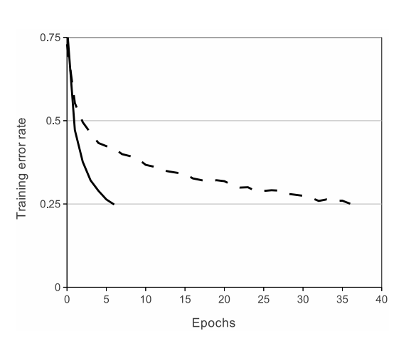
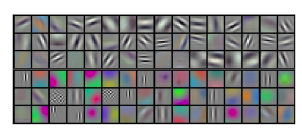

## Paper: [ImageNet Classification with Deep Convolutional Neural Networks](https://papers.nips.cc/paper/2012/file/c399862d3b9d6b76c8436e924a68c45b-Paper.pdf)

## Introduction
This paper introduces model **AlexNet** which created a huge impact and in the field of Deep Learning in terms of training Neural Network and achieveing good results on ImageNet dataset.

## Novel Contributions
* ### Introduction of ReLU(Recitified linear unit) activation function
$$\mathrm{ReLU} = \mathrm{max\(0,x\)}$$

Before ReLU's introduction the main non linearity used was  $\tanh(x)$ or $\frac{1}{1 + \mathrm{e}^{-x}}$. 

ReLU activation function gives acceleration to the training process of the neural networks and also avoids the problem of saturation present with the earlier activation functions.

#### [Convergene graph of tanh vs ReLU](https://papers.nips.cc/paper/2012/file/c399862d3b9d6b76c8436e924a68c45b-Paper.pdf) 
[Fig](#convergence-graph-of-tanh-vs-relu) presented in the paper shows that solid-line(ReLU) training error converges faster compared to that of dotted-line(tanh) function.

* ### MultiGPU Training
AlexNet model was spread across 2 GPU's, in all the layers half the kernels and input was present on one GPU and half on the other. 

* ### Overlapping Polling
AlexNet uses Overlapping pooling i.e using a pooling kernel with stride less than the size of kernel. 

* ### Data Augmentation
1. Cutting a patch of 224x224 and its horizontal reflection from the 256x256 image.
2. Changing the intensity of the RGB pixel values based on PCA heuristics.

* ### Dropout
Using Dropout on the first two layers of the AlexNet model.

## Visualizations

Representation learned by the first 11x11x3 kernels.

