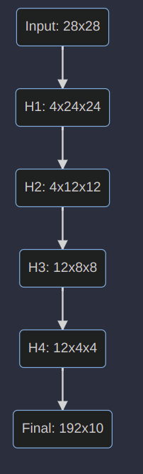

# Handwritten Digit Recognition with a Back-Propagation Network

## Task
Handwritten Digit Recognition is a computer vision task of identifying a digit gievn its image.


## Solution Approach 
The author of the paper proposed a solution to use Back-Propagation to train a network which contains shared weight feature extractor, famously known as convolutional-kernel.
Take the image and classify it to one of the 10 classes [0,1,2,3,4,5,6,7,8,9].
* Take the image of the digit and convert it to GRAYSCALE image, Basically RGB -> GRAYSCALE
* Create a Network architecture which uses convolution filter and has learnable weights.
* Train the model using Back-Propagation algorithm.


## Network Architecture 
_Now we will look at the network architecture presented in the paper and also use Pytorch to build layers._

The Network consists 4 layers, named H1, H2, H3, H4 and final layer. 
The input flow of model is **Input -> H1 -> H2 -> H3 -> H4 -> Final** .

#### Shape details:

Authors uses idea of feature extractor, which is a _single neuron with a receptive field_ (as mentioned in the paper) on a single 2d plane/channel the receptive field of the neuron is taken to be as 5x5.


##### Fig:1 Model Architecture


### H1:


```python
		H1 = nn.Conv2d(
			in_channels=1,
			out_channels=4,
			kernel_size=5, 
			)

```
Layer H1 is a 2d convolutional layer which takes a single channel 2d plane as input and returns 4 channel 2d plane.
The kernel_size is the shape of shared feature extractor i.e 5x5. 

### H2:

```python
		H2 = nn.AvgPool2d(
			kernel_size=(2,1),
			stride=(2,2),
			)

```
Layer H2 is a 2d Average pooling layer which takes a single channel 2d plane as input and returns a subsampled plane downsized to H/2, W/2 as the stride is 2 in both the direction in height and width.


### H3:

```python
		H_3_1 = nn.Conv2d(
			in_channels=1,
			out_channels=1,
			kernel_size=5, 
			)
		H_3_2 = nn.Conv2d(
			in_channels=2,
			out_channels=1,
			kernel_size=5, 
			)
		H_3_3 = nn.Conv2d(
			in_channels=2,
			out_channels=1,
			kernel_size=5, 
			) 
		H_3_4 = nn.Conv2d(
			in_channels=1,
			out_channels=1,
			kernel_size=5, 
			)
		H_3_5 = nn.Conv2d(
			in_channels=2,
			out_channels=1,
			kernel_size=5, 
			) 
		H_3_6 = nn.Conv2d(
			in_channels=2,
			out_channels=1,
			kernel_size=5, 
			)
		H_3_7 = nn.Conv2d(
			in_channels=1,
			out_channels=1,
			kernel_size=5, 
			) 
		H_3_8 = nn.Conv2d(
			in_channels=2,
			out_channels=1,
			kernel_size=5, 
			) 
		H_3_9 = nn.Conv2d(
			in_channels=2,
			out_channels=1,
			kernel_size=5, 
			) 
		H_3_10 = nn.Conv2d(
			in_channels=1,
			out_channels=1,
			kernel_size=5, 
			) 
		H_3_11 = nn.Conv2d(
			in_channels=2,
			out_channels=1,
			kernel_size=5, 
			)
		H_3_12 = nn.Conv2d(
			in_channels=2,
			out_channels=1,
			kernel_size=5, 
			)
```
Layer H3 is again a 2d convolutional layer which takes 4 channel 2d plane as input and returns 12 channel plane as output, 
The kernel_size is also the same as H1 layer.  
The connection however is not trivial as just using 12 different kernels and giving 12 channels as output which is the default behaviour of nn.conv2d. To demonstrate the idea presented in the paper i have created multiple conv2d instances to get the output.

### H4:

```python
		H2 = nn.AvgPool2d(
			kernel_size=(2,1),
			stride=(2,2),
			)

```
Layer H4 is similar to H2 layer i.e. a 2d Average pooling layer which takes a single channel 2d plane as input and returns a subsampled plane downsized to H/2, W/2 as the stride is 2 in both the direction in height and width.


### Final Layer

```python
		final = nn.Linear(in_features=192, out_features=10)
```
 Now comes the Final Layer which is a fully connected layer with an input dimension of 192 and output dimension of 10 (Number of classes).
 

### Reference
1. [Handwritten Digit Recognition with a Back-Propagation Network](https://proceedings.neurips.cc/paper/1989/file/53c3bce66e43be4f209556518c2fcb54-Paper.pdf)


